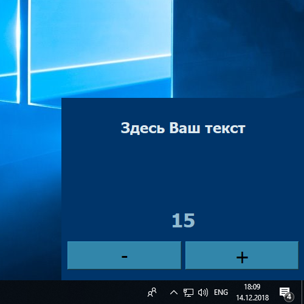
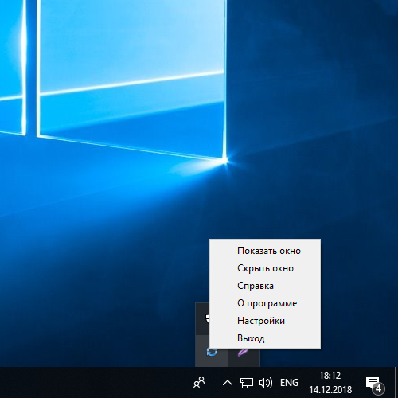
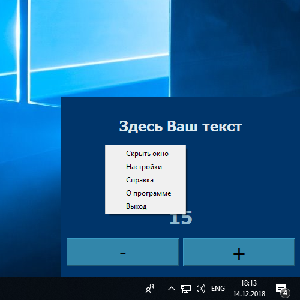
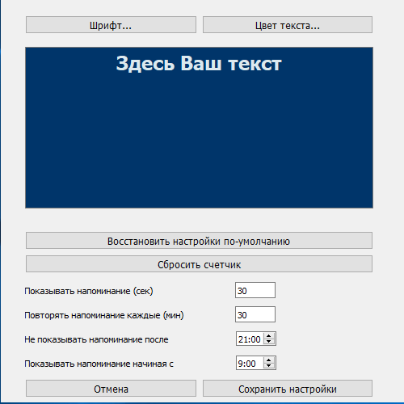
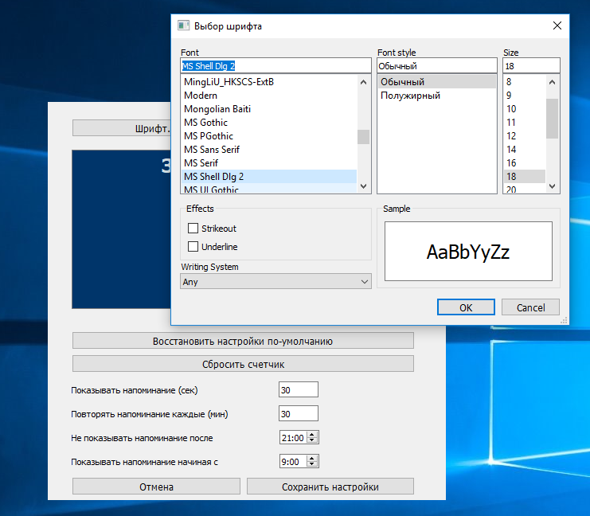

## Напоминалка

Идея в том, чтобы через определенные промежутки времени программа напоминала о каком-либо действии.
Например, следить за осанкой. Кнопки со знаком + и знаком - нажимаются в зависимости от того, выполнялось ли требование в мосент запуска программы.
Например, если во время показа окна пользователь сидит с ровной осанкой - он жмет **+** (плюс), если нет то **-** (минус).
Сответсвенно, счетчик увеличивается или уменьшается. Цель - увеличение счетчика.

Программа написана на Python3 и PyQT5. 
Для запуска программы нужно использовать встроенный планировщик операционной системы 
или запускать его вручгную. 
Окно приложения будет показываться через определенные пользователем промежутки времени и будет 
видимым определнное пользователем в настройках количество секунд.
Окно приложения будет показываться только в определнное время суток.
При запуске программа создает значок в системном трее. Значок имеет свое контекстное меню для управления.
Значок программы виден всегда, независимо от того скрыто или показано окно приложения в данный момент.
Основное окно также имеет контестное меню, которое аналогично контестному меню значка в системном трее.
Все настройки программы делаются через окно настроек, которое вызывается при нажатии на пункте 
**Настройка** контекстного меню главного окна или значка в трее.
Окно настроек позволяет настроить следующие параменты:

- Время в секундах, в течении которого будет показываться главное окно.
- Время в минутоах, в течении которого будет скрыть окно приложения
- Восстановить настройки по-умолчанию
- Сбросить счетчик
- Установить время суток, с которого окно приложения не будет показываться
- Установить время суток, в течении которого начинать показывать окно приложения
- Изменить шрифт текста и размер (кроме MacOS)
- Изменить цвет текста 

На MacOS кнопка выбора шрифта недоступна. Можно изменить только цвет текста.

При настройке запуска через планировщик Windows необходимо указывать рабочий каталог.

Проверена работа программы под Windows, MacOS, CentOS, Ubuntu.
Для Windows есть скомпилированный фалы **.exe** в каталоге **/dist**.

При запуске приложение создает в рабочем каталоге файл - **reminder.pid**.
При попытке запуска второго экземляра, приложение проверяет наличие данного файла, и, если
обнуживает его, то заверщает свою работу, предотвращая таким образом запуск нескольких экземпляров приложения одновременно.
При закрытии приложение удаляет указанный файл.
   

Контекстное меню значка программы в системном трее.

Контестное меню главного окна программы.   

Форма настроек позволяет задать следующие параметры.
   - **Текст напоминалки.** Их может быть несколько
   - **Восстановить значения по умолчанию** - позволяет вернуть первоначальные настройки
   - **Сбросить счетчик** - позволяет обнулить счетчик. Например, это можно делать с утра, если баллы накапливаются каждый день с нуля.
   - **Показывать напоминание (сек)** - время в секундах, в течении которого будет отображаться главное окно программы.
   - **Повторять напоминание каждые (мин)** - время в минутах, в течении которого окно будет скрыто.
   - **Не показывать напоминание после** - время суток, после которого не показывать окно. Например, чтобы не показывать ночью.
   - **Показывать напоминание начиная с** - время суток, с которого снова показывать главное окно программы.

 
 
 Окно выбора шрифта для текста.
 
 
 
 Окно выбора цвета текста.
 
 